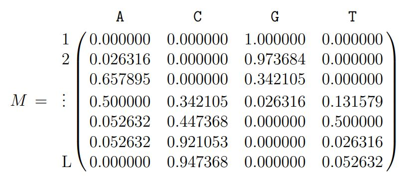
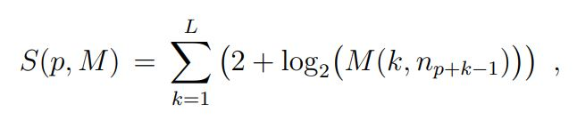
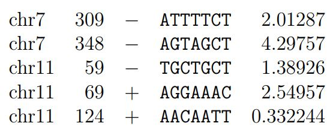

# Project in Bioinformatics

## Genomic Motives

### Goal of the program

This program aim to find short motives in a genome's seqence. The genome has multiple chromosomes, each one consiting of a long nuclotides sequence.

### What is a motive

A motive is the short genomic signature which is described by a Position-Weight Matrix (PWM):



The number of ligns L represents the motives' length, the columns represents the 4 possible nucleotides and their respective weights (probability of finding the specific nucleotide at the position).

Thus we can compute, for each position p on each chromosome, the score of the motive is:



where n_j is the nucleotide at the j position and M(j,n) the element of the PWD for nth column and jth lign. 

### How to use the program

There are 2 different ways of using the program:

1. The user gives the PWM and the genome's sequence, the program outputs the positions p where the score S(p,M) > T for a given T.

2. The user gives a list of genome's positions as well as the genome, the program outputs the PWM by computing the frequencies of nucleotides at those positions. The user must also specify the length L of the researched motive. 

## Formats

The parameters of the program are the following:

- the genome: a FASTA file
- the matrice M: a tabular file
- the limit T: a float
- the positions to consider to compute the matrix: a BED file

## Difficulties

As the genome files are huge, there must be only one read once and cannot be saved in memory.

## Results

The results for the 1st usage should look like the following:



Where the columns are: 
- the name of the FASTA sequence
- the position of this sequence
- its orientation
- the computed motive
- the computed score

For the 2nd usage, the result is the PWM and a FASTA file with the extracted sequences for each interval of the BED file.

## How to use the code

```
main.cpp --file --sequence
```